# IntelliScan Platinum — **ACAM40 보충 매뉴얼**

> **대상** ACAM40 ACU 를 쓰는 운영자
> **함께 보는 문서** `IntelliScan Platinum Administrator's Manual` (이하 **원본 매뉴얼**)
> **문서 버전** `0.4` · **상태** 🚧 **작성 중 — 배포 전입니다**

> **🛑 경고**
> **아직 배포하지 마십시오.** 제목 옆에 `⬜` 가 붙은 자리는 **아직 확인하지 못한 것**입니다.
> 남은 것은 **부록 C** 에 모아 두었습니다.

---

## 0. 이 문서를 읽는 법

Platinum 은 **IDTi ACU** 를 기준으로 만들어졌습니다. **ACAM40은 IDTi와 다른 회사 제품** 으로
구조적 차이가 있습니다. 그래서 같은 기능이라도 **동작 방법이 다릅니다.**

이 문서는 **그 차이만** 담습니다. 나머지는 원본 매뉴얼에 준해서 작성 했습니다.

```
원본 매뉴얼   Platinum 전체 사용법         ← 먼저 봅니다
이 문서      ACAM40 에서 달라지는 것만      ← 옆에 두고 봅니다
```

### 동작 방법으로 찾기

| 하려는 일 | 문서 위치 |
|---|---|
| 문이 안 열린다 · 이벤트가 이상하다 | **1.4 문제가 생겼을 때** |
| ACU 를 새로 놓았다 · 교체했다 | **3.1 ACU 를 세우기** |
| 사람에게 권한을 주고 싶다 · 뺏고 싶다 | **3.9 권한 주기 · 뺏기** |
| 문 여는 시간을 바꾸고 싶다 | **3.6 시간대 내용 보내기** |
| 공휴일을 넣고 싶다 | **3.7 공휴일 보내기** |
| 문을 지금 열고 싶다 · 닫고 싶다 | **3.10 문 열고 닫기** |
| 이 기능이 ACAM40 에서 되나 | **2.2** · **부록 A** |
| 이벤트에 뜬 말이 무슨 뜻인가 | **5장 이벤트 읽기** |

### 표기

| 표시 | 뜻 |
|---|---|
| 🟢 | ACAM40 에서 **됩니다** |
| 🟡 | **일부만** 됩니다 |
| 🔴 | ACAM40 에서 **안 됩니다** — 화면에 칸이 있어도 눌러도 아무 일이 없습니다 |
| ➖ | **해당 사항이 없습니다** |

안내 상자는 넷입니다. **경고는 아껴 씁니다** — 이 문서 전체에 네 개뿐입니다.

> **알아두기** — 알고 있으면 이해가 빨라지는 것입니다.

> **💡 팁** — 몰라도 되지만 알면 편한 것입니다.

> **⚠ 주의** — 모르면 **헛수고를 하거나 설정이 어긋나는** 자리입니다.

> **🛑 경고** — 모르면 **문이 열린 채로 남거나, 막았다고 믿은 사람이 드나듭니다.**

### 🚧 근거 표시 — 작성 중이라 붙여 둡니다

이 문서가 완성되면 아래 표시는 지웁니다. 지금은 **어디까지 확인된 이야기인지** 구분해 둡니다.

| 표시 | 뜻 |
|---|---|
| ✅ | **실장비로 확인했습니다** |
| 📄 | **프로그램 소스 · 장비 규격 · 제조사 매뉴얼로 확인했습니다** — 실장비 확인은 아직입니다 |
| ⬜ | **아직 확인하지 못했습니다.** 그대로 믿지 마십시오 |

### 🔤 **ACU** — 이 문서가 쓰는 말

| 이 문서의 말 | 무엇 |
|---|---|
| **ACU**(Access Control Unit) | 기종을 안 가리는 일반 지칭 |
| **ACAM40 ACU** | ACAM40 컨트롤러 |
| **IDTi ACU** | IDTi 컨트롤러 |

용어는 **Platinum 화면 말**을 쓰고, ACU 안에서 부르는 이름이 다르면 괄호로 붙입니다 —
`엑세스 그룹(도어그룹)` · `시간대(타임코드)`. 전체 대조는 **2.4**.

> **알아두기** — 메뉴 이름(`컨트롤러 관리` · `컨트롤러 동기화` · `컨트롤러 등록`)은
> **화면 글자 그대로** 두었습니다. 화면에서 `컨트롤러` 를 찾으셔야 합니다.

---

## 1. 시작하기

### 1.1 ACAM40 은 무엇이 다른가

| | **ACAM40** | **IDTi(SSC-324)** | 문서 위치 |
|---|---|---|---|
| 운영모드 · 스케줄 | 🔴 기능 없음 | 🟢 | 4장 §3.2 |
| 권한 레벨(등급) | 🔴 기능 없음 | 🟢 | 2.2 |
| 인터록 · 투맨 · 출입구역 | 🔴 기능 없음 | 🟢 | 2.2 |
| **안티패스백(APB)** | 🟡 **ACU에 기능은 있음. Platinum에서 UI 미지원** | 🟢 **Platinum 매뉴얼에 내용 없음**| **2.3** |
| 출입문 카메라(이미지 요청) | 🔴 없음 | 🟢 | 4장 §1.5 |
| 썸머타임 | 🔴 | 🟢 | 부록 A |
| **그룹 정의를 보내는 명령** | 🔴 없음 — `설정 다운로드` 가 한 번에 풉니다 | 그룹별로 따로 있음 | 3.1 |
| **공휴일** | ⚠ **연도가 박힙니다** — 해마다 다시 보냅니다 | 매년 반복 | 3.7 |
| 공휴일 받기(조회) | 🔴 | 🟢 | 부록 A |
| 유효기간 **리스트** 전송 | 🔴 — 사람의 카드에 실려 나갑니다 | 🟢 | 3.8 |
| **강제개방 중 열림 · 닫힘** | 🔴 **ACU 가 거부합니다** | 🟢 동작 | **3.10** |
| **이벤트 종류** | **19가지** | 55가지 | 5장 |
| `통신 › 연결 끊김` 이벤트 | 🔴 안 올라옴 | 🟢 | 5장 |

🟢 **같은 것** — 카드 포맷 · 시간대 AND 판정 · 사용자그룹 8칸 · 엑세스 그룹 적용 방식 ·
사용자 전송 · 보고서 · 맵.

### 1.2 판정에 쓰이는 것은 **4가지**뿐입니다   📄

```
엑세스 그룹 · 도어 시간대 · 사용자 시간대 · 유효기간
```

도어 시간대와 사용자 시간대는 **AND** 로 처리 됩니다.

> **알아두기**
> *"카드 사용자가 출입을 하기 위해서는 3가지 조건이 맞아야 합니다. 카드번호 · 도어 접근 권한(도어그룹) ·
> 시간 접근 권한(시간코드). 위 3가지 중 하나라도 어긋나면 ACU는 사용자에게 출입을 제한합니다."*
> 이벤트 **거부 이유 3가지** → **1.4.1**

🟢 **사용자 카드정보에는 그룹 8개중 하나만 통과하면 인증됩니다**

### 1.3 지원하지 않는 기능은 **오류가 아닙니다**   ✅

ACAM40이 지원하지 않는 명령을 보내면 결과창에 이렇게 뜹니다.

```
이 장비에서 지원하지 않는 기능입니다.          ✅ 초록 체크 (전송 완료)
```

**빨간 실패가 아닙니다.** ACU 고장이 아니라 **"이 ACU 에는 해당 없음"** 이라는 뜻이니
그냥 넘어가시면 됩니다.

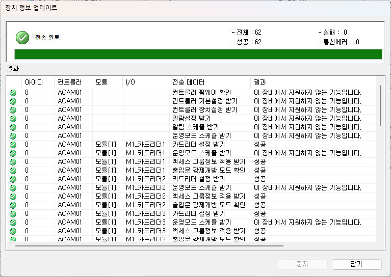

위 그림은 ACAM01 을 업데이트한 결과입니다. **전체 62 · 성공 62 · 실패 0** 이고,
줄마다 결과가 `이 장비에서 지원하지 않는 기능입니다.` 인데도 **모두 초록 체크**입니다.
전체 목록은 **부록 A** 에 있습니다.

---

### 1.4 문제가 생겼을 때 — 문서 어디를 보나?

#### 1.4.1 먼저 **이벤트 화면에서 승인 거부 이유**를 보세요   ✅

| 이벤트 | 내용 | 문서 위치 |
|---|---|---|
| 승인 거부 › **허용안함** | ACU에 **사용자 정보가** 없습니다 | `사용자 전송` 을 했는지 · **3.9** |
| 승인 거부 › **타임존** | 리더기 **사용 시간대**가 아닙니다 | 카드리더 속성의 **도어 시간대 번호** · **3.6** |
| 승인 거부 › **권한 레벨(등급)** | **사용자 정보**의 그룹 · 시간대가 안 맞습니다 | 엑세스 그룹 **3.5** · 사용자 시간대 **3.9** |
| 승인 거부 › **인증유효기간** | 유효기간 **범위 밖**입니다 | **3.8** |
| **이벤트 내용 없음** | 카드를 못 읽었습니다 | **1.4.3** |

> **⚠ 주의** — **`권한 레벨(등급)` 은 이름이 잘못 붙은 것입니다.**
> ACAM40 에 등급 개념은 없습니다(2.2). 이 줄이 뜨는 진짜 뜻은
> **"카드에 실린 (엑세스 그룹, 시간대) 짝이 그 문을 못 연다"** 입니다.
> ⇒ 등급이 아니라 **엑세스 그룹과 사용자 시간대**를 보십시오.

```
태그 → ① 그 문의 시간대가 지금 열려 있나?     아니면 → 거부 › 타임존
     → ② 카드의 (엑세스 그룹, 시간대) 가 맞나?  아니면 → 거부 › 권한 레벨(등급)
```

#### 1.4.2 증상으로 찾기

| 증상 | 먼저 볼 문서 위치 |
|---|---|
| 특정 한 사용자만 안 열린다 | 그 사람의 **유효기간 · 사용자 시간대 · 그룹 소속** (3.9) |
| **이벤트가 아예 안 뜬다** | 🔴 **사용자 ID 가 `1`~`20000` 의 숫자인지** — 범위 밖이면 ACU로 안 나갑니다 (2.1) |
| 한 사용자에게 그룹을 더 줬는데 안 먹는다 | 🔴 **그룹은 한 사람에 8개까지**입니다. 9개째는 전송이 안됩니다 (2.1) |
| 한 그룹이 통째로 안 열린다 | **`적용`을 눌렀는지** (3.5). 안 눌렀으면 ACU 안의 표가 비어 있습니다 |
| 그 ACU 의 **모든 문**이 안 열린다 | 컨트롤러 동기화가 끊겼는지 (3.11) → **3.1 설정 다운로드** |
| 특정 시간에만 안 열린다 | 도어 시간대와 사용자 시간대가 **AND** 로 겹칩니다 (1.2) |
| 새로 만든 시간대인데 안 열린다 | **시간대 내용을 보냈는지** (3.6) |
| 카드가 `0000…` 으로 읽힌다 | **1.4.3** |
| 아무도 없는데 이벤트가 쏟아진다 | **1.4.4** |
| 아무나 모든 문을 연다 | **3.5 경고** — 엑세스 그룹 0건일 때 보낸 카드입니다 |
| **열림 · 닫힘을 눌렀는데 듣지 않는다** | **3.10** — 강제개방 · 강제잠금 상태입니다 |

#### 1.4.3 카드가 `0000…` 으로 읽히거나 안 읽힐 때   ✅

리더의 **리더 종류 · 카드 포맷**이 `0` 이 되면 그렇게 됩니다.

➡️ **3.4 카드리더 설정하기**에서 올바른 값을 넣고 `실행` 하십시오.
그래도 안 되면 **DIP 8번 초기화 → 3.1 설정 다운로드 → 사용자 전송** 순서로 되살립니다.

#### 1.4.4 태그를 안 했는데 이벤트가 쏟아지면   ✅

**증상** 아무도 카드를 대지 않는데 이벤트가 끝없이 올라옵니다.
`입력 정상복귀` / `입력 화재센서 알람발생` 이 번갈아 찍힙니다.

**원인** 배선하지 않은 입력점이 켜져 있습니다. 특히 **NC** 는 "평상시 닫혀 있어야 정상" 이라
아무것도 연결하지 않은 단자가 **영구 알람**으로 읽힙니다.

**조치** **3.1 설정 다운로드**를 한 번 하십시오. 입력점을 비웁니다.

> **⚠ 주의** — **앱을 새로 깔아도 안 없어집니다.** 설정은 **ACU 안에** 들어 있습니다.
> 이미 이벤트가 가득 찬 뒤라면 **전원을 껐다 켜도 안 풀립니다.**

---

## 2. 알아두기

### 2.1 한도 — 쓸 수 있는 번호 범위   📄

| | **ACAM40** | **IDTi** (SSC-324) |
|---|---|---|
| 엑세스 그룹 | `1` ~ **`255`** ⚠ 아래 | `1` ~ **`1024`** |
| 시간대 | `1` ~ **`98`** | `1` ~ **`512`** |
| 유효기간 | ➖ 기능 없음 | `1` ~ **`512`** |
| 사용자그룹 | `1` ~ **`255`** | `1` ~ **`1024`** |
| 권한 레벨(등급) | ➖ 기능 없음 | `1` ~ `14` · 관리자 `63`·`95`·`127` |
| 한 사람의 그룹 | **8개** | **8개** (같음) |
| 사람 | **20,000명** | **100,000명** ⚠ 아래 |
| 리더 · 입력 · 출력 | **8 · 8 · 8** | 리더 4 · 입력 16 · 출력 8 |
| ACU 주소 | `1` ~ `32` | `1` ~ `32` (같음) |

> **⚠ 주의 — 엑세스 그룹 번호 `143` 과 `159` 는 쓰지 마십시오.**   📄
> 제조사 매뉴얼: *"모든 컨트롤러에 도어그룹은 1 부터 254 까지 최대 252 개를 설정할 수 있습니다.
> **143 번과 159 번은 컨트롤러에서 자체적으로 사용하고 있어 사용할 수 없는 도어그룹번호**입니다."*
> 펌웨어의 자리 수는 255 지만 **운영에서 쓸 수 있는 것은 252 개**입니다.
> 이 번호를 쓰면 **오류 없이 조용히 어긋납니다.** ⬜ 실물로 재현해 보지는 않았습니다.

> **🛑 경고 — 사용자 ID 는 `1` ~ `20000` 의 숫자여야 합니다.**
> ACU 가 그 번호를 **자리 번호로** 씁니다. 범위 밖이거나 숫자가 아니면 **ACU로 아예 전송이 안됩니다.**
> 화면에는 멀쩡히 보이므로 **권한을 준 줄 알았는데 그 사용자는 등록조차 되어 있지 않습니다.**

> **알아두기** — ACAM40 본체에 **입출력확장보드**를 붙이면
> 리더 · 입력 · 출력이 최대 72 까지 늘지만, **Platinum에서는 확장보드를 지원하지 않습니다.**

### 2.2 화면에 있어도 ACAM40이 쓰지 않는 것

| 설정 | 이유 |
|---|---|
| **운영모드**(제어 · 스케줄) | 기능 없음 — ACU가 거부합니다 ✅ |
| **스케줄**(도어모드 · 알람벨) | 기능 없음 ✅ |
| **서머타임** | 기능 없음 📄 |
| **권한 레벨(등급)** | 기능 없음 <br>⚠ 그런데 **이벤트에는 `권한 레벨(등급)` 이라는 거부 사유가 뜹니다** — 이름만 그럴 뿐 뜻이 다릅니다 → 1.4.1 |
| 인터록 · 투맨 · 출입구역 | 기능 없음 📄 |

전체 목록은 **부록 A** 에 있습니다.

### 2.3 ACAM40에는 있는데 **Platinum에서 지원 못 하는 기능**   📄

> **알아두기** — 아래는 **ACAM40에 기능이 있습니다.** 하지만
> Platinum에서 **구조적**인 문제로 지원 하지 않는 것입니다.

| 기능 | ACAM40 매뉴얼 내용 | Platinum |
|---|---|---|
| **안티패스백(APB)** | 도어마다 `적용 = YES` 로 켜고 **APB 코드 1~8** 과 **입문/출문** 을 정합니다. 한 코드에는 입문과 출문이 **각각 하나 이상** 있어야 합니다 | 🔴 **칸은 있지만 모양이 다릅니다** — 아래 |
| **출력그룹** | *"모든 컨트롤러에 출력그룹은 1 부터 100 까지 최대 100 개"* | ➖ 대응 화면 없음 |
| **입력그룹 · 입출력연동규칙** | 입력그룹이 출력그룹을 **묶어서** 움직이게 합니다 | ➖ 대응 화면 없음. Platinum 은 입력센서의 **반응 모듈 · 반응 장치**로 **1 대 1** 연동만 합니다(3.2) |
| **지문리더기** | *"00 번부터 31 번까지 최대 32 개"* · 컨트롤러와 **별도 네트워크**로 관리 | 🔴 `지문리더 값 변경`은 ACAM40 에서 안 받습니다(부록 A) |

#### 안티패스백은 왜 Platinum 에서 안 되는가   📄

Platinum 에도 **안티패스백이라는 칸은 있습니다.** 사용자 · 사용자그룹 · 장치의
`장치옵션` 탭에 체크박스 세 개(`안티패스백 적용` · `지역 안티패스백` · `글로벌 안티패스백`)가
있습니다. 그런데 **그 칸이 담는 것이 ACU가 기다리는 것과 다릅니다.**

| | 무엇을 기준으로 켜나 | 무엇을 적나 |
|---|---|---|
| **ACAM40** | **리더 마다** | 이 문은 **APB `3`번 구역의 `입문`** 이다 |
| **Platinum** | **사용자 마다** | 이 사람에게 APB 를 **쓴다 / 안 쓴다** (한 칸) |

🔴 **Platinum 의 칸에는 「구역 번호」와 「입문 / 출문」을 적을 자리가 아예 없습니다.**
IDTi(SSC-324) 를 기준으로 만든 칸이기 때문입니다. 그래서 체크를 해도 **ACAM40 이 알아들을
모양으로 나갈 수가 없습니다.** 게다가 ACAM40 에서는 **`장치옵션` 탭이 통째로 잠깁니다**(3.2 · 3.3).

➡️ **ACAM40이 못 하는 것이 아니라, 구조가 다릅니다.**

> **⚠ 주의 — APB 이벤트는 실제로 올라옵니다.**
> Platinum 에서 APB 를 켤 수 없어도, **SS2006 프로그램으로 켜 둔 현장**이라면
> `인증 › 승인 거부 › 안티 패스 백`(`0102010c`) 이 이벤트에 뜹니다(5장).
> **거부 사유 셋(1.4.1)에 안 들어가는 넷째 사유**라 *"카드도 그룹도 맞는데 안 열린다"* 로 보입니다.
>
> SS2006 프로그램에는 그 이벤트를 눌러 **APB 규칙을 초기화**하는 길이 있습니다.
> ⬜ **Platinum 에는 푸는 길이 확인되지 않았습니다.**
> ⇒ **현장에 APB 가 켜져 있는지 먼저 확인하십시오.** 안 켜져 있으면 겪을 일이 없습니다.

### 2.4 용어 대조   📄

> **이 문서는 왼쪽 칸(Platinum 화면 말)을 씁니다.** 오른쪽은 **장치관리자 로그**에서 만납니다.

| Platinum 매뉴얼 용어 | ACAM40 매뉴얼 용어 | 갯수 | 비고 |
|---|---|---|---|
| **엑세스 그룹** · 장치그룹 | **도어그룹** | **252개** (`1`~`254`, `143`·`159` 제외) | 화면에 두 이름이 다 나옵니다. 같은 것입니다 |
| **시간대** | **타임코드** | **98개** (`1`~`98`) | 🔴 **번호가 다릅니다: ACAM 번호 = 시간대 번호 + 2** |
| 사용자그룹 | 도어그룹 **번호** | 한 사람에 **8개** | 1:1 로 같은 번호를 씁니다 |
| 사용자 | **카드(PID)** · 출입증 | **20,000명** | 🔴 **사용자 ID 가 곧 자리 번호**입니다 → 2.1 |
| 카드리더 | 리더 = **도어** = 출력점 | | ACAM40 은 셋이 같은 번호입니다 |
| 설정 다운로드 | **환경파일 전송** | | 제조사 프로그램에서 부르는 이름입니다 → 3.1 |

로그에 보이는 `출입 시간대 1 → 타임코드 3` 은 그 번호 변환입니다. 같은 것을 가리킵니다.

> **알아두기 — 시간대 번호 `1`·`2` 는 ACU 가 예약해 두었습니다**(1=항상 거부, 2=항상 허용).
> 그래서 화면의 시간대 1번이 ACU 안에서는 3번입니다.
> **운영자가 계산할 일은 없습니다** — 프로그램이 알아서 바꿔 보냅니다.

---

## 3. 설정

| 설정 | 문서 위치 |
|---|---|
| **ACU 설정하기** | 3.1 설정 다운로드하기 |
| **장치 설정하기** | 3.2 입력센서 · 3.3 출력릴레이 · 3.4 카드리더 |
| **권한 주기** | 3.5 엑세스 그룹 적용하기 · 3.9 사람에게 주고 뺏기 |
| **데이터 보내기** | 3.6 시간대 · 3.7 공휴일 · 3.8 유효기간 |
| **제어 · 확인** | 3.10 문 열고 닫기 · 3.11 ACU 설정 되읽기 |

장치 설정 트리에서 ACAM ACU 를 펼치면 이렇게 보입니다.

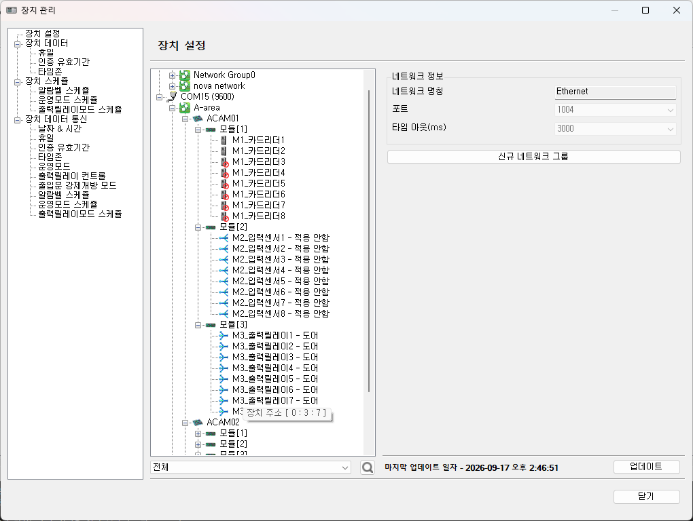

### 3.1 ACU 설정하기 — **설정 다운로드하기**   ✅

> **ACAM40 운영에서 가장 중요한 버튼입니다.**

**Step 1.** 풀다운 메뉴에서 `장치 관리 < 장치 설정` 을 클릭합니다.
**Step 2.** 트리에서 대상 ACU 를 선택합니다.
**Step 3.** 오른쪽 `기본정보` 탭 아래쪽 **`세부 설정`** 묶음을 봅니다.
**Step 4.** **`다운로드 설정`** 오른쪽의 **`다운로드`** 버튼을 클릭합니다.

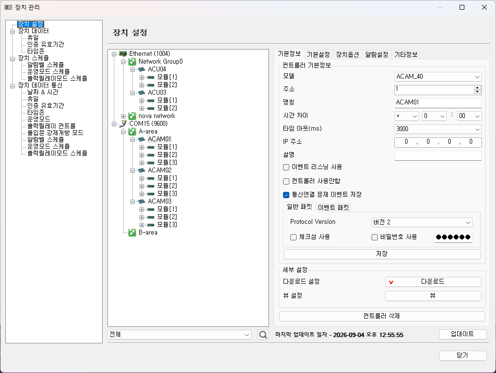

**무엇이 나가나요**

```
ACU정보 → 동작 중지 → 시간 → 공휴일(비우고 전체) → 시간대 리스트 전체
       → 도어그룹(전 도어 + 사용자그룹별) → 입력점 · 출력점 · 리더 · 도어 → 동작 시작
```

🟢 **다운로드 버튼 클릭 한번으로 ACU 설정이 완료됩니다.** 화면 여럿을 순서대로 누를 필요가 없습니다.

**이럴 때 누르세요**

- 신규 설치 · ACU 교체 후
- 태그를 안 했는데 이벤트가 쏟아질 때 (1.4.4)
- 컨트롤러 동기화가 중간에 끊겼을 때 (3.11)
- DIP 8번 초기화 후

> **⚠ 주의** — **사용자정보(카드정보)는 안 나갑니다.** 사용자 전송이 맡습니다(3.9).
> **공휴일은 연도가 박힙니다** — 해가 바뀌면 다시 하십시오(3.7).

> **알아두기** — **`장치 설정 → 세부 설정 → 다운로드`** 와 **장치관리자(IntelliScan Device Manager)의 `Download`** 는
> **같은 기능**입니다. 어느 쪽을 눌러도 결과가 같습니다.
> SS2006 프로그램에서는 이것을 **`환경파일 전송`** 이라고 부릅니다.

> **알아두기** — 컨트롤러를 등록할 때 넣는 **주소(`1`~`32`)는 장비에 물리적으로 잡아 둔
> 주소와 같아야 합니다.** 제조사 문서도 *"ACAM40 컨트롤러 ID 는 실제 ACU 의 컨트롤러 ID 와
> 동일해야 한다"* 고 못박습니다. 한 네트워크에는 ACU 를 **16대까지** 지원 합니다. 📄

### 3.2 입력센서 설정하기   ✅

> **퇴실버튼 · 문열림 감지 · 화재 입력을 ACU에 알려 주는 자리입니다.**
> ACAM40은 설정 기능이 IDTi(SSC-324) 보다 적습니다.

**Step 1.** 장치 설정 트리에서 입력센서를 클릭합니다.
**Step 2.** 값을 고칩니다.
**Step 3.** 창 아래 실행 콤보에서 **`입력센서 설정 변경`** 을 선택하고 `실행` 을 클릭합니다.

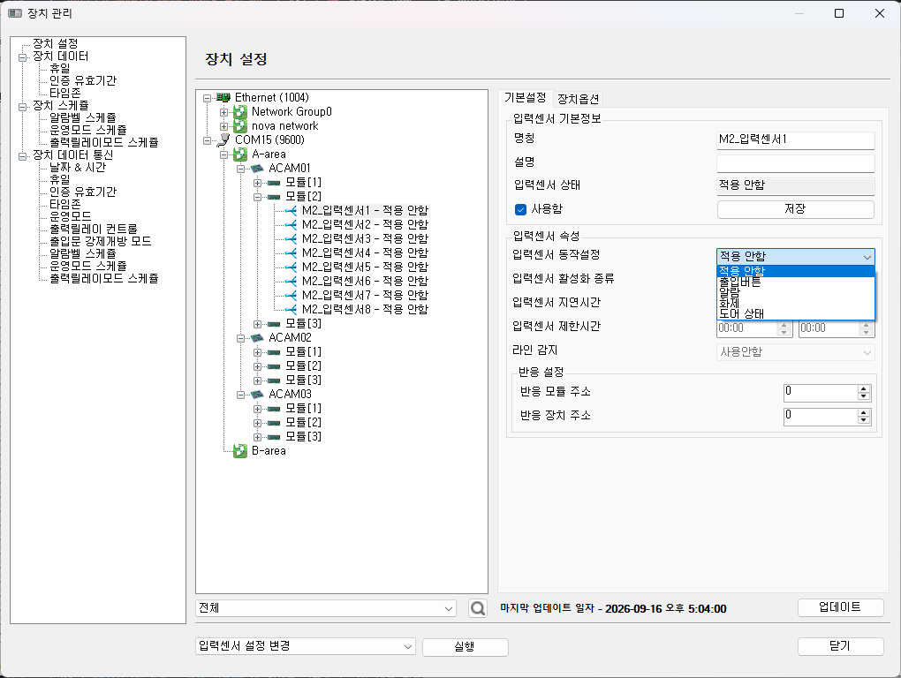

**동작설정으로 5가지를 선택 할 수 있습니다.** 비활성화된 지연시간 · 제한시간 · 라인 감지도 같이 보입니다.

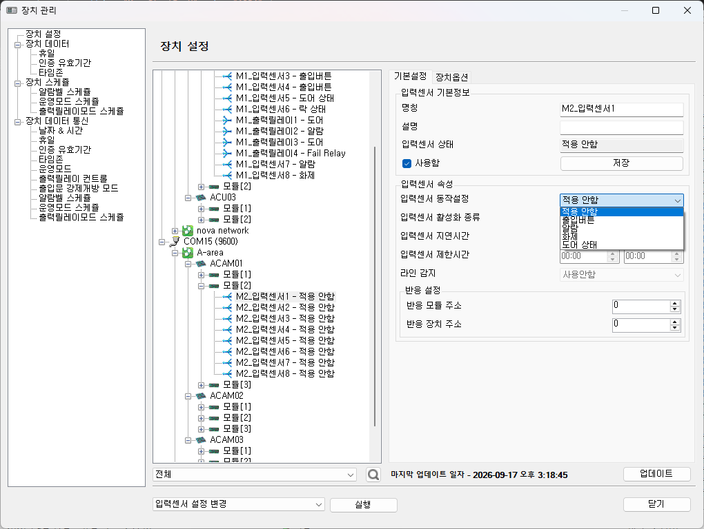

같은 창을 IDTi 에서 열면 이렇습니다 — **비교용**입니다.

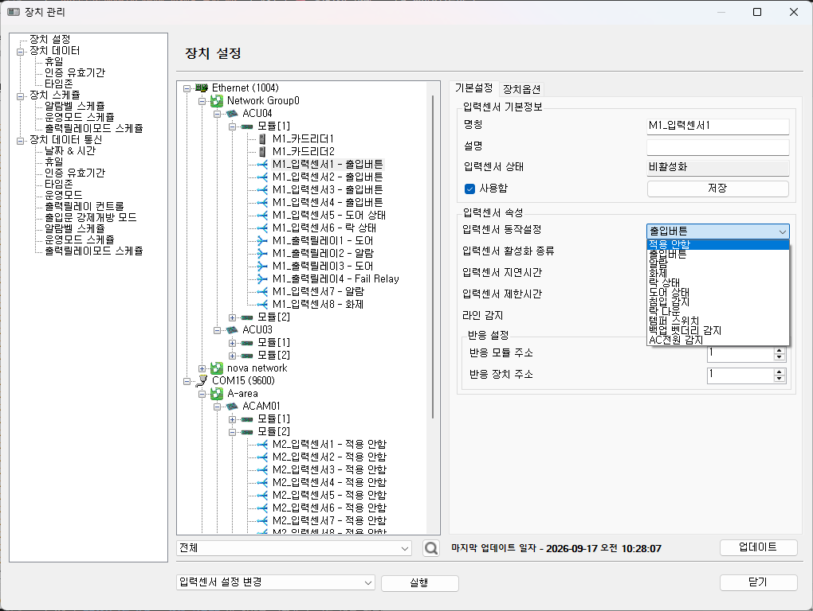

| 구분 | ACAM40 기능 | 비고 |
|---|---|---|
| 명칭 · 설명 · 사용함 | 🟢 저장 버튼으로 설정 | 📄 |
| 입력센서 상태 | 🟢 읽기 전용 | 📄 |
| **동작설정** | 🟡 **5가지만** — `적용 안함` · `출입버튼` · `알람` · `화재` · `도어 상태` | ✅ |
| **활성화 종류** | 🟢 NO / NC | ✅ |
| **반응 설정**(반응 모듈 · 반응 장치) | 🟢 출력릴레이 연결 | ✅ |
| **라인 감지** | 🔴 **비활성(기능 없음)**입니다 | 📄 |
| 지연시간 · 제한시간 | 🔴 **비활성(기능 없음)**입니다 | 📄 |
| 장치옵션 탭 | 🔴 **비활성(기능 없음)** | 📄 |

> **⚠ 주의** — **`저장` 버튼은 명칭 · 설명 · 사용함만 저장합니다.**
> 나머지 값은 **`실행`** 을 눌러야 ACU 와 DB 에 함께 들어갑니다. IDTi 도 같은 방식입니다.

> **🛑 경고 — 문이 닫혀 있을 때 하십시오.**
> ACAM40 펌웨어는 입력점 설정을 새로 받으면 **그 입력의 현재 상태를 지우고 다시 읽습니다.**
> 그때 입력이 활성 상태(문이 열려 있다 · 버튼이 눌려 있다)면 **새로 생긴 알람으로 보고
> 반응 릴레이를 울립니다.** ✅
> 출력릴레이도 마찬가지입니다 — **설정을 받으면 켜져 있던 릴레이의 타이머가 지워져
> 열려 있던 문이 그 자리에서 닫힙니다.**(3.3)

**설정 받아오기** — 🟢 `설정 받기` 와 `업데이트` 는 **둘 다 ACU 설정 값을 받아 옵니다.** ✅

| `구분` | `설정 받기` | `업데이트` |
|---|---|---|
| ACU 질의 응답 | 🟢 예 | 🟢 예 |
| 받은 값 | **화면에 바로 표시** DB 에도 저장 | **DB 에만** 저장 |
| 화면 | 즉시 표시 | 창을 닫으면 **DB에서 다시 불러옴** |

### 3.3 출력릴레이 설정하기   ✅

> **문이 몇 초 동안 열려 있을지를 정하는 자리입니다.**
> ACAM40에서 지원하는 기능은 **활성화 시간 하나**뿐입니다.

**Step 1.** 장치 설정 트리에서 출력릴레이를 클릭합니다.
**Step 2.** **활성화 시간**을 입력합니다(초).
**Step 3.** 실행 콤보에서 **`출력릴레이 설정 변경`** 을 선택하고 `실행` 을 클릭합니다.

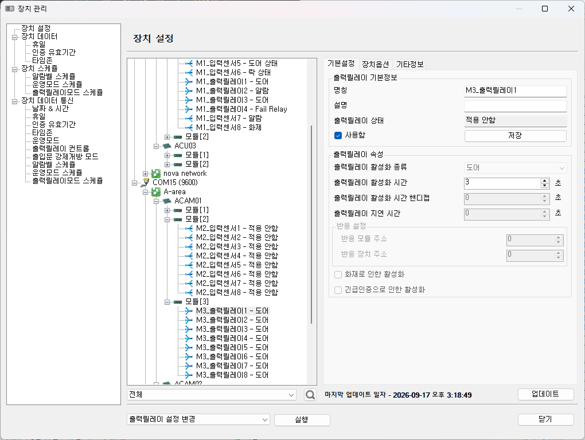

**활성화 시간만 쓸 수 있고** 나머지는 비활성화입니다. `장치옵션` 탭도 통째로 잠깁니다.

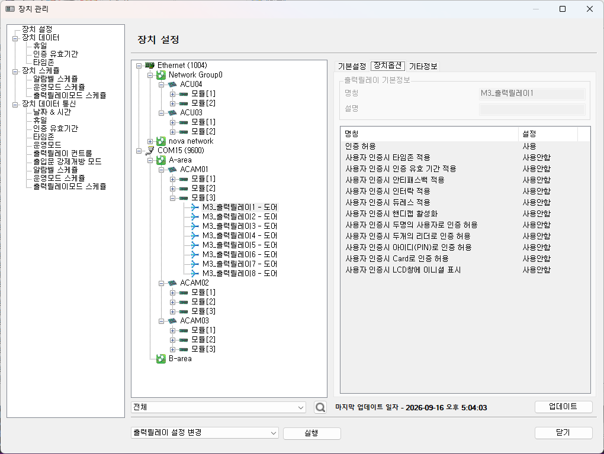

같은 창을 IDTi 에서 열면 이렇습니다 — **비교용**입니다.

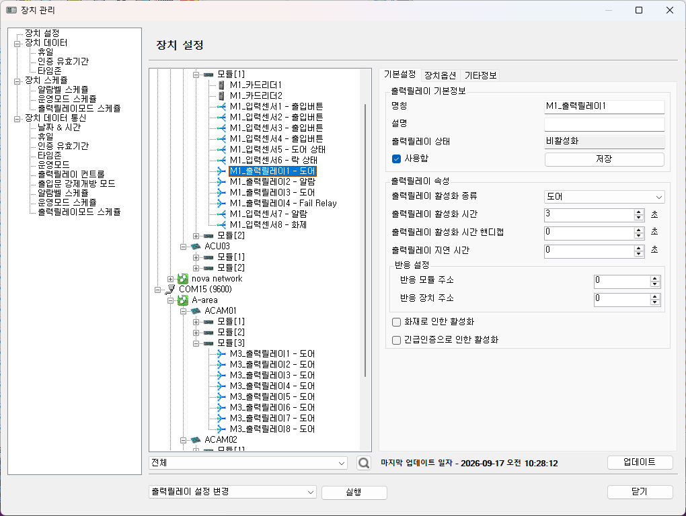

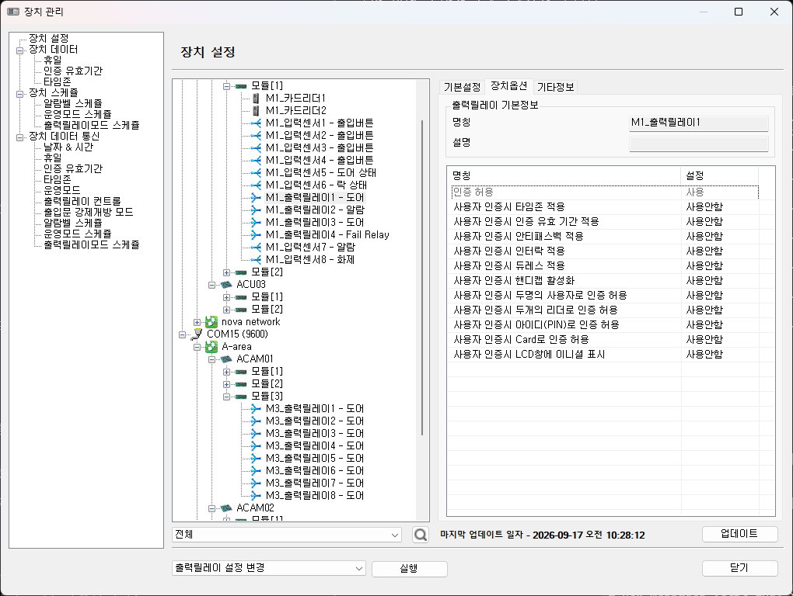

| 구분 | ACAM40 |
|---|---|
| 명칭 · 설명 · 사용함 | 🟢 저장 버튼으로 설정 |
| 출력릴레이 상태 | 🟢 읽기 전용 |
| **활성화 시간** | 🟢 **이 창에서 쓸 수 있는 유일한 설정값** |
| 활성화 종류(도어 · 알람 · 락다운 …) | 🔴 **비활성** |
| 활성화 시간 핸디캡 · 지연 시간 | 🔴 **비활성** |
| 반응 모듈 · 반응 장치 | 🔴 **비활성** — 출력점과 도어의 연결은 **카드리더 속성**이 정함 |
| 화재 · 긴급인증 활성화 | 🔴 **비활성** |
| 장치옵션 탭 | 🔴 **비활성** |

🟢 `설정 받기` · `업데이트` 로 ACU의 활성화 시간을 받아 올 수 있습니다.

> **⚠ 주의** — **열려 있던 문이 곧바로 닫힐 수 있습니다** → 3.2 의 경고.

### 3.4 카드리더 설정하기   ✅

> **카드 포멧과 출입문 허용 시간대를 설정하는 창입니다.**
> 설정을 잘못 하면 **카드를 아예 못 읽습니다.**

**Step 1.** 장치 설정 트리에서 리더를 클릭합니다.
**Step 2.** 카드 포맷 · 도어 시간대 설정 합니다.
**Step 3.** `저장` 후 `실행` 을 클릭합니다. **리더와 도어 2개의 데이터**가 전송 됩니다.

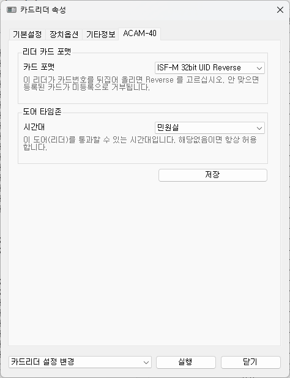

> **알아두기 — ACAM40에서는 리더 = 도어 = 출력점이 같은 번호입니다.**
> 리더1은 도어1이고 출력1 입니다. 제조사 문서도 *"리더기는 모두 도어와 1:1 로 연동"*
> 이라고 되어 있습니다.

**시간대 번호만 바꾼 것인지, 내용까지 바꾼 것인지 가르십시오.**

```
도어 타임존 변경                    → 이 창의 실행으로 충분합니다
시각·요일을 수정 · 처음 쓰는 번호      → 3.6 으로 내용을 먼저 보내야 합니다
```

> **⚠ 주의** — **변경된 내용을 저장만 하고 카드리더 설정 변경을 실행 안 하면 그 문은 아무도 못 엽니다.**
> ACU 에 없는 번호를 가리키게 되기 때문입니다.

### 3.5 엑세스 그룹 설정   ✅

> **"어느 그룹이 이 문을 쓸 수 있는가" 를 ACU에 전송하는 창입니다.**
> 사람에게 그룹을 주는 것(3.9)과 **다른 일**입니다 — 둘 다 해야 문이 열립니다.

**Step 1.** 카드리더 속성 창에서 `기타정보` 탭을 클릭합니다.
**Step 2.** 엑세스 그룹을 고릅니다.
**Step 3.** `추가` 또는 `삭제` 를 클릭합니다.

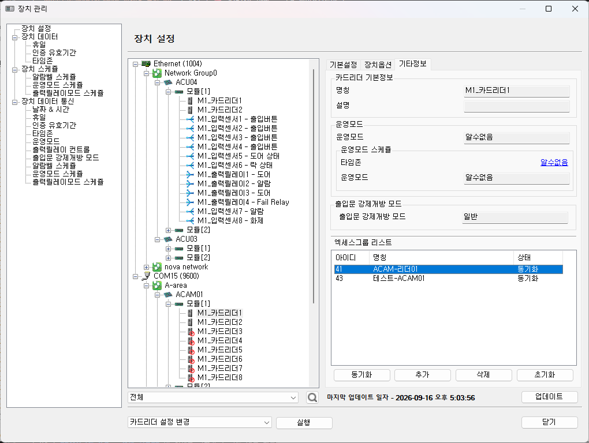

| 구분 | 내용 |
|---|---|
| **추가** | 그 리더에 그 엑세스 그룹 추가 |
| **삭제** | 그 리더에 그 엑세스 그룹 삭제 |

**순서가 있습니다.**

```
① 카드리더 속성 → 기타정보 → 추가   (그룹을 먼저)
② 사용자 관리 → 사용자 전송        (그 다음 카드)
```

> **⚠ 주의** — **사용자 전송은 그 사용자의 카드 한 장만 보냅니다. 엑세스 그룹 리스트는 안 나갑니다.**
> 새 그룹을 만들고 사용자 전송만 하면 카드가 **ACU에 없는 그룹 번호**를 가리켜
> **그 카드는 아무 문도 못 엽니다.**

> **🛑 경고 — 엑세스 그룹이 하나도 없는 ACU에 보낸 카드는 「전체 허용」으로 설정 됩니다.**
> 그 뒤에 그룹을 만들어도 **그 카드는 표를 보지 않습니다** — 계속 모든 문이 열립니다.
> ⇒ **0건 → 1건 이상으로 넘어가는 순간, 카드를 전부 다시 보내십시오.**
> (이미 1건 이상인 상태에서 그룹 내용만 바꾸는 것은 표만 보내면 됩니다.)
> ⬜ 장비 규격에서 나온 이야기이고, 실장비로 재현해 보지는 않았습니다.

> **⚠ 주의 — 삭제는 취소할 수 없습니다.** 되돌리려면 **`적용`** 으로 다시 넣으십시오.
> 상태 표시가 화면마다 다릅니다 — **같은 상태인데 이름만 다릅니다.**
>
> ```
> 엑세스 그룹 화면      "삭제 대기"   · 저장 전이면 [취소] 로 되돌릴 수 있습니다
> 장치 설정 → 기타정보  "비동기화"    · 곧바로 실행됩니다. 취소가 없습니다
> ```

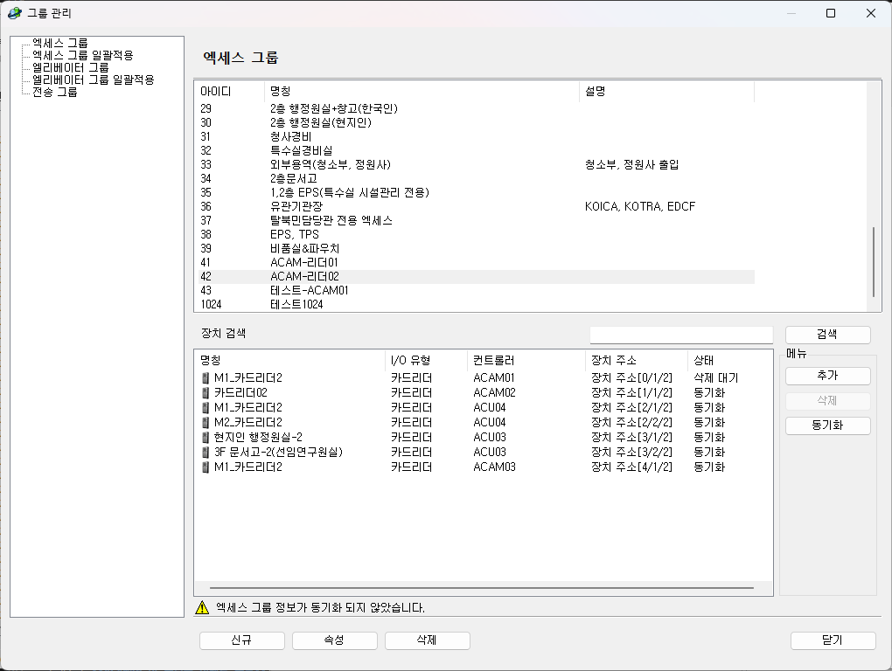

### 3.6 시간대 내용 보내기   ✅

> **시간대의 시각 · 요일을 고쳤다면 반드시 여기를 거쳐야 합니다.**

**Step 1.** 풀다운 메뉴에서 `장치 관리` 를 클릭합니다.
**Step 2.** 왼쪽 메뉴에서 **`장치 데이터 통신 → 타임존`** 을 클릭합니다.
**Step 3.** 위 목록에서 보낼 ACU 를 고릅니다.
**Step 4.** 아래 콤보에서 **`타임존 변경`** 을 고르고 **`실행`** 을 클릭합니다.

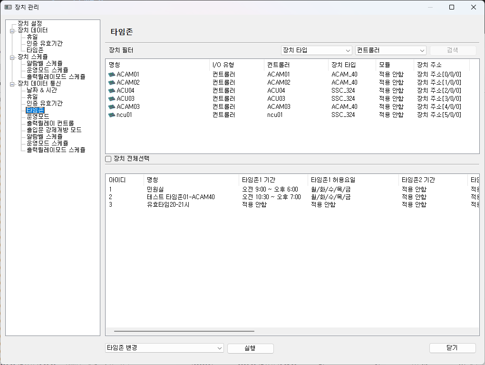

> **⚠ 주의 — 안 쓰는 시간대 번호를 고르십시오.**   📄
> **시간대 1 은 IDTi 쪽 실사용자가 씁니다. 고치면 그 사람들이 다 영향받습니다.**
> ACAM40 용으로 쓸 시간대는 **아무도 안 쓰는 번호**로 새로 만드십시오.

### 3.7 공휴일 보내기   ✅

> **쉬는 날에 문을 평일처럼 열지 않게 하는 자리입니다.**
> ACAM40 은 **해마다 다시 보내야** 합니다.

**Step 1.** 풀다운 메뉴에서 `장치 관리` 를 클릭합니다.
**Step 2.** 왼쪽 메뉴에서 **`장치 데이터 통신 → 휴일`** 을 클릭합니다.
**Step 3.** `휴일스케쥴 기간` 에서 연도를 고르고, 위 목록에서 ACU 를 고릅니다.
**Step 4.** 아래 콤보에서 **`휴일 보내기`** 를 고르고 **`실행`** 을 클릭합니다.

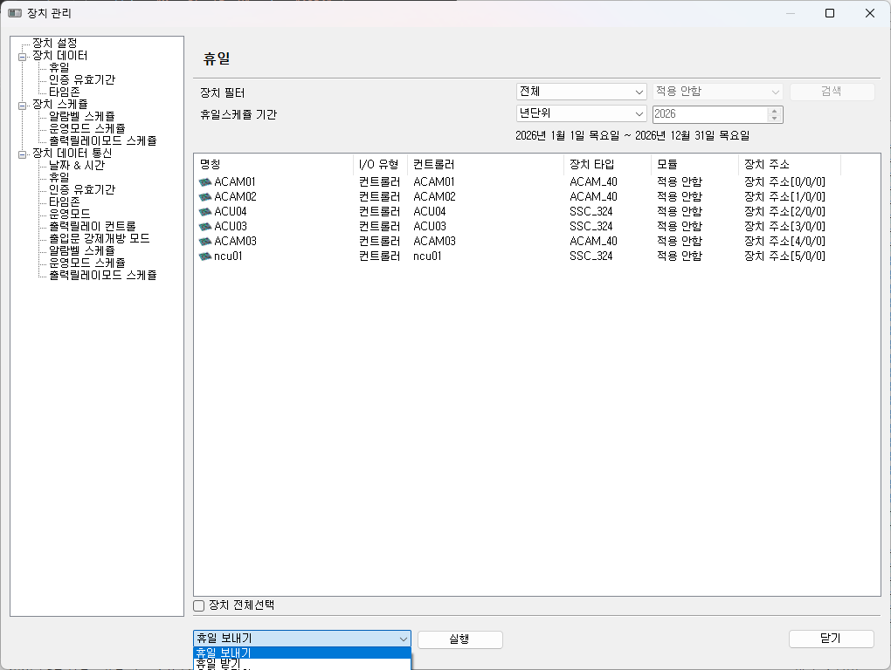

> **⚠ 주의 — ACAM40 의 공휴일에는 연도가 박힙니다.**
> IDTi 와 달리 **매년 반복되지 않습니다.**
> **해가 바뀌면 그 해 공휴일을 등록하고 다시 내려보내야 합니다.**
> ⬜ 해가 바뀌는 동작은 실장비로 확인하지 않았습니다.

> **💡 팁** — `도구 → 옵션 → 데이터 통신` 의 **휴일 자동 동기화**를 켜 두면
> 해가 바뀔 때 프로그램이 대신 보내 줍니다. ⬜ **ACAM40 에서 도는지는 확인 전입니다** —
> 연초에 공휴일이 들어갔는지 **눈으로 한 번 확인하십시오.**

🔴 **`휴일 받기` 는 ACAM40 에서 막아 두었습니다**(부록 A). IDTi 에서는 됩니다.

### 3.8 유효기간 주기   📄

유효기간은 **사람의 카드에 실려** ACU 로 나갑니다.

**Step 1.** `장치 데이터 → 인증 유효기간` 에서 쓸 기간을 만듭니다.

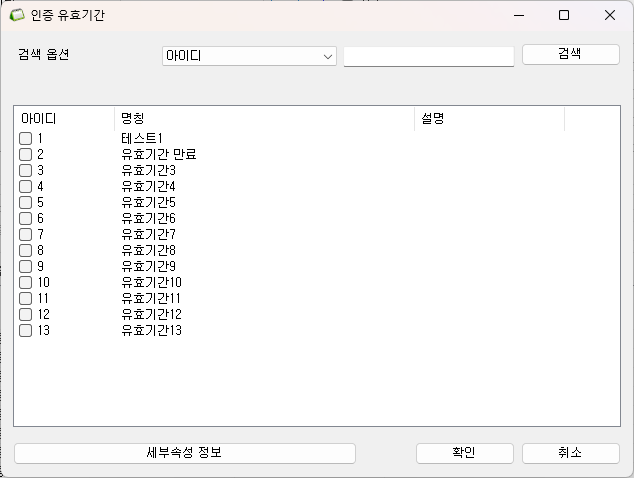

**Step 2.** 사용자 속성 → `사용자 장치옵션` 탭의 **인증 유효기간** 칸에서 고릅니다.

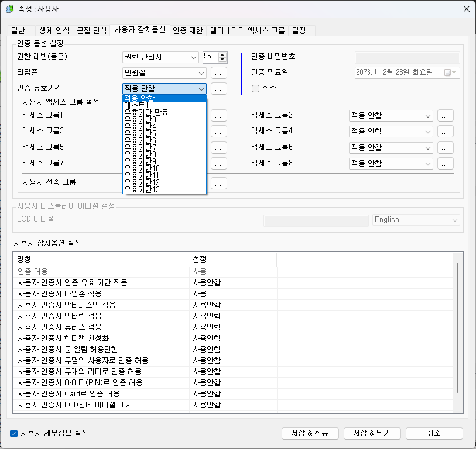

**Step 3.** `사용자 전송` 을 합니다(3.9).

기간 밖이면 ACU 가 막고 **`인증 › 승인 거부 › 인증유효기간`** 이벤트를 올립니다(5장).

> **알아두기** — ACU 가 유효기간을 **실제로 본다는 근거는 있습니다.** 📄
> ACAM40 펌웨어에 *시작일 오류* · *종료일 오류* 두 이벤트가 있고 그것이 위 코드로 올라옵니다.
> ⬜ **실장비로는 아직 확인하지 않았습니다.** 확인할 때는 **그 이벤트가 뜨는지**를 보십시오.

> **알아두기** — **유효기간 표를 통째로 보내는 명령은 ACAM40 이 받지 않습니다.**
> `장치 데이터 통신 → 인증 유효기간` 화면에서 보내면 `지원하지 않는 기능입니다` 로 뜹니다.
> 그것이 정상입니다 — 유효기간은 **사람마다 카드에 실려** 갑니다.

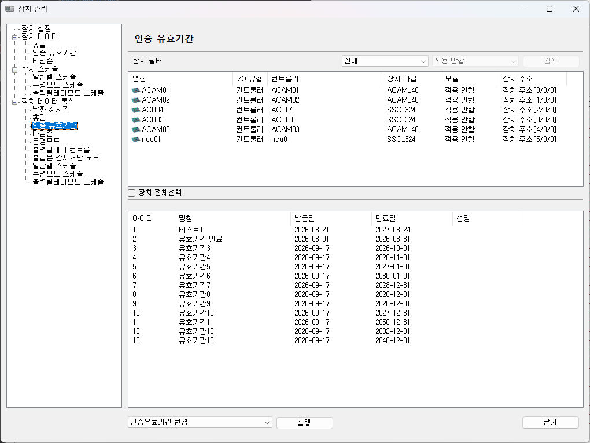

### 3.9 권한 주기 · 뺏기

**주기** — 사용자 관리에서 그 사람의 **엑세스 그룹 · 시간대 · 유효기간**을 정하고
**`사용자 전송`** 을 누릅니다. 새 그룹이라면 **3.5 의 `적용`을 먼저** 하십시오.

**뺏기** — 🛑 **`사용자 전송`으로는 안 뺏깁니다.**

> **🛑 경고 — 권한을 뺏을 때는 `카드 삭제` 를 쓰십시오.**
> 권한이 하나도 없어진 사람은 **사용자 전송이 실패합니다**(`실패 - 시스템`).
> 빈 권한으로 덮어써서 남의 권한까지 지우는 것을 막는 안전장치인데,
> **뺏는 경우에는 ACU 에 옛 카드가 그대로 남습니다.**
> 화면에서는 권한이 없어 보여도 **그 사람은 계속 문을 엽니다.**
> ⇒ 실제로 막으려면 **`카드 삭제`**(원본 §4.4 vi) 를 쓰십시오.

> **⚠ 주의 — 일괄적용은 DB 만 바꿉니다. ACU 로는 아무것도 안 나갑니다.**   📄
> 바꾼 뒤에 **`사용자 전송`** 을 따로 하십시오.

### 3.10 문 열고 닫기   ✅

`장치 데이터 통신 → 출력릴레이 컨트롤` 에서 보냅니다.

| 누른 것 | ACAM40 에서 일어나는 일 |
|---|---|
| **열림 N초** | 문이 열리고 **N초 뒤 저절로 닫힙니다** |
| **열림 도중에 `닫힘`** | **즉시 닫힙니다.** 그 뒤 다시 `열림` 을 누르면 정상으로 열립니다 |
| **닫힘** | 닫힌 채로 둡니다 — **열리지 않습니다** |

> ✅ **확인** — ACAM01 에 열림 · 닫힘 · 열림 도중 닫기 · 열림 5초 자동 복귀를
> 차례로 보냈고 **오류 0건**이었습니다.

> **⚠ 주의 — 강제개방 · 강제잠금 중에는 열림 · 닫힘이 듣지 않습니다.**
> **ACAM40 과 IDTi 가 갈리는 자리입니다.**
>
> | | 강제 상태에서 `열림` 또는 `닫힘` |
> |---|---|
> | **IDTi** | 🟢 그대로 동작합니다 |
> | **ACAM40** | 🔴 **ACU 가 거부합니다.** 아무 일도 일어나지 않습니다 |
>
> ACU 고장이 아닙니다. ACAM40 펌웨어는 출력점이 **평상(스케줄) 상태일 때만** 열림 · 닫힘을
> 수행하고, 강제 상태이면 거절하도록 만들어져 있습니다.
> 제조사 프로그램도 같은 구조입니다 — *"이 기능(강제개방 · 강제폐쇄)이 더 이상 필요치 않으면
> **자동모드로 전환**해 두어야 합니다."* 📄

화면에는 이렇게 뜹니다.

```
강제개방·강제잠금 중에는 열림·닫힘을 쓸 수 없습니다. 먼저 해제하십시오.
```

➡️ **푸는 길은 하나입니다.**

```
장치 관리 → 장치 데이터 통신 → 출입문 강제개방 모드  →  해제
```

🔴 **`닫힘` 으로는 안 풀립니다.** 같은 명령을 다시 보내도 답은 같습니다 —
**상태를 먼저 바꾸셔야 합니다.**

### 3.11 ACU 설정 되읽기 — 업데이트 · 컨트롤러 동기화   ✅

> **화면과 ACU 가 어긋났는지 확인하고 맞추는 자리입니다.**
> 화면 값을 ACU 로 보내는 것이 아니라 **ACU 에 물어보는** 쪽입니다.

**Step 1.** 장치 설정 → ACU 를 선택하고 `기타정보` 탭을 엽니다.
**Step 2.** 맨 아래 `컨트롤러 동기화` 를 클릭합니다.
**Step 3.** 동기화할 항목을 체크하고 실행합니다.

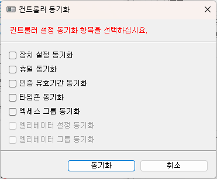

🟢 **눌러도 됩니다.** ACU 안의 표를 비운 뒤 다시 채웁니다.
🟢 결과창에 **"지원하지 않는 기능입니다"** 가 수십 줄 뜨는 것은 **정상**입니다(1.3).

진행 중에는 이렇게 보입니다. **제목줄에 `X` 가 없습니다.**

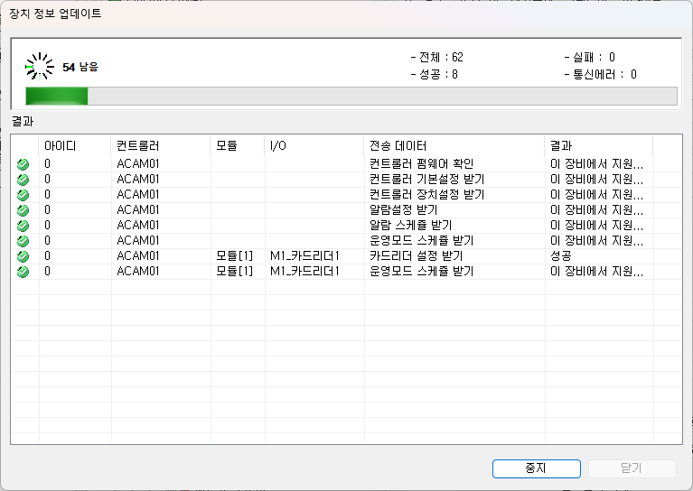

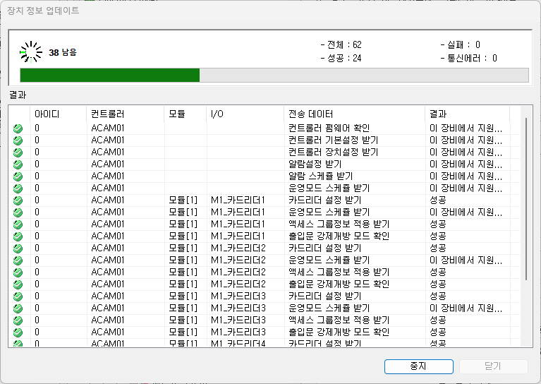

> **알아두기 — 전송 · 업데이트 창은 진행 중에 닫을 수 없습니다.**
> 일부러 `X` 를 없앤 것입니다 — 예전에는 그때 `X` 를 누르면 **앱 전체가 굳었습니다.**
> 끝날 때까지 기다리십시오. 다 끝나면 닫는 버튼이 생깁니다.
> 오래 걸리는 것이 정상입니다. 컨트롤러 동기화는 수십 줄을 차례로 보냅니다.

> **⚠ 주의 — 중간에 끊기면 그 ACU 의 문을 아무도 못 엽니다.**
> 표가 빈 채로 남기 때문입니다. 누른 뒤에는 결과를 확인하고,
> 이상하면 **3.1 설정 다운로드**로 표를 다시 세우십시오.

---

## 4. 원본 매뉴얼과 대조

> 원본 매뉴얼을 보다가 아래 절에 이르면 이 쪽을 함께 보십시오.
> 여기 없는 절은 **원본 그대로**입니다.

### 원본 §1.1 ~ §1.4 네트워크 설정 · 서버 접속 · 로그인 (p9~12)

➖ **ACAM40 와 무관합니다.** 장치관리자에 접속하는 이야기라 ACU 종류를 가리지 않습니다.

### 원본 §1.5 v. 기타 정보 — 통신 정보 · 출입문 카메라 (p15~18)

- 🟢 **통신 정보** — ACAM40 도 정상으로 표시됩니다. 📄
  `연결` · `연결 끊김` · `응답없음` · `사용안함` 네 가지가 그대로 쓰입니다.

  > **알아두기** — **이벤트 목록에는 `통신 › 상태 › 연결 끊김` 줄이 안 뜹니다**(5장).
  > 표시 방식이 다를 뿐이니 **왼쪽 통신 정보를 보십시오.**

- 🔴 **출입문 카메라** — ACAM40 에는 카메라가 없습니다. 이 창은 **늘 비어 있습니다**. 📄
- 🟢 사용자 인증 정보(최근 4명 사진) · 이벤트 로그뷰 · 사용자 컬럼 정의 — 화면 기능이라 같습니다.

### 원본 §2.1 i. 3) 장치정보가 변경되면 항상 Update 를 실행한다 (p20)

⚠ **이 체크를 켜 두면 장치 관리를 열 때마다 `장치 정보 업데이트` 창이 뜰 수 있습니다.**

ACAM40 은 업데이트로 읽어 오는 항목이 적어서, **아직 안 받아온 항목**이 남아 있으면
이 옵션이 그것을 매번 다시 시도합니다. 창이 자꾸 뜨면 **3.1 설정 다운로드**를 한 번 해서
받아올 것을 없애 주십시오.

### 원본 §2.4 데이터 통신 — 자동 동기화 (p23~25)

- 🟡 **i. 사용자 자동 동기화** — 사용자를 고치면 자동으로 카드를 보냅니다. ⬜ ACAM40 확인 전입니다.

  > **⚠ 주의** — **자동 동기화도 카드만 보냅니다.** 엑세스 그룹 리스트는 안 나갑니다 → **3.5**

- 🔴 **ii. 휴일 자동 동기화가 ACAM40 에서는 특히 중요합니다** → **3.7 의 팁**. ⬜ 확인 전입니다.

### 원본 §2.6 장치 → 근접인식 (p25~28)

🟡 리더 종류 · 카드 포맷은 ACAM40 에서도 쓰입니다. 다만 **잘못 건드리면 카드가 안 읽힙니다** → 1.4.3

### 원본 §3.1 컨트롤러 관리 → iv. 컨트롤러 등록 (p32~35)

- **모델** — ACAM40 을 고릅니다.
- **주소 [1 ~ 32]** — ACAM40 도 같습니다. **장비에 잡아 둔 주소와 같아야 합니다**(3.1).
- 🔴 **이미지 요청[BSC-401]** — ACAM40 에는 해당 없습니다.
- 🟡 **Step 6 자동 업데이트** — ACAM40 은 업데이트로 읽어 오는 항목이 IDTi 보다 적습니다.
  등록 직후에는 **3.1 설정 다운로드**를 한 번 하십시오. 그래야 ACU 가 완성됩니다.

### 원본 §3.2 운영모드 제어 (p36~42)

🔴 **ACAM40 에는 운영모드 개념이 없습니다.** 이 절은 건너뛰십시오.

> ✅ **확인** — ACAM01 에 실제로 보냈더니 ACU 가 받지 않았습니다
> (`운영모드 값 변경` · `운영모드 스케줄`).

### 원본 §3.3 출력릴레이 **제어** (p43~48)

- 🟢 **제어(열림 · 닫힘)** — 됩니다 → **3.10**
- 🔴 **출력릴레이 모드 스케줄 제어**(p44~47) — ACAM40 에 스케줄 개념이 없습니다. ✅
- ⚠ 출력릴레이의 **설정**(활성화 시간 등)은 원본 매뉴얼에 설명이 없습니다 → **3.3**

### 원본 §3.3 휴일 설정 및 등록 (p49~52)

- 🟢 **보내기(전송)** 는 됩니다 → **3.7**
- 🔴 **공휴일 받기(조회)** 는 ACAM40 에서 막아 두었습니다. ✅
- ⚠ **연도가 박힙니다** → **3.7**

### 원본 §4.4 사용자 신규등록 / 편집 (p75~88)

- 🟡 **유효기간** → **3.8**
- 🟢 **사용자 시간대** — 쓰입니다. 도어 시간대와 **AND** 로 겹칩니다. 📄
- ⬜ **권한 레벨(등급)** — ACAM40 에는 개념이 없어 무시된다고 보고 있습니다. 확인 전입니다.
- ⚠ **권한을 뺏을 때는 `사용자 전송`이 아니라 `카드 삭제`** → **3.9**

### 원본 §4.4 iv. 사용자 만료 (p80~83)

원본은 **만료일을 어제 날짜로 고치고 `사용자 보내기`** 하라고 합니다.
이 방법은 **ACU 가 유효기간을 실제로 보는 것**을 전제로 합니다 → **3.8**

⚠ **확실하게 막으시려면 `카드 삭제` 를 쓰십시오** → **3.9 의 경고**

### 원본 §4.4 xiv. 사용자 정보 일괄적용 (p103~104)   📄

🟡 **엑세스 그룹 · 전송 그룹 · 시간대 · 유효기간은 ACAM40 에도 그대로 적용됩니다.**
⚠ **DB 만 바꿉니다** → **3.9**

### 원본 §5.1 엑세스 그룹 관리 (p105~115)

- 🟢 등록 · 편집 · 삭제 · 일괄적용 모두 됩니다.
- ⚠ **새 그룹을 만들었으면 `적용`을 먼저** → **3.5**
- ⚠ **번호 `143` · `159` 는 쓰지 마십시오** → **2.1**

### 원본 §6 맵 (p134~152)

🟢 됩니다. 맵에서 여는 **입력센서 속성 · 출력릴레이 속성 창은 장치 설정에서 여는 것과 같은 창**이라
3.2 · 3.3 이 그대로 적용됩니다.

### 원본 §7 이벤트 (p153~162)

- 🟢 **이벤트 뷰어 설정** — 화면 기능이라 ACU 와 무관합니다.
- 🔴 **이벤트 재취득 · 이벤트 초기화**(p161~162) — ACAM40 에서는 받지 않습니다. ✅
- 어떤 이벤트가 올라오는지는 **5장**.

### 원본 §8 보고서 (p163~177)

🟢 **보고서 기능 자체는 ACU 와 무관합니다.** 다만 **담을 내용이 없는 보고서**가 있습니다.

| 보고서 | ACAM40 |
|---|---|
| 사용자 상세 · 연락처 · 요약 Type 1~4 · 사용자 목록 | 🟢 같습니다 |
| **비인가 구역 출입 사용자**(p172) | 🔴 **늘 비어 있습니다** — ACAM40 에 **출입구역 개념이 없습니다** 📄 |
| 컨트롤러 목록 | 🟢 뜹니다 |
| **입력센서 · 출력릴레이 목록**(p175~176) | 🟡 뜹니다. 단 ACAM40 에서 **안 쓰는 칸은 빈 값**입니다(3.2 · 3.3) |
| 리더 목록 | 🟢 뜹니다 |
| 이벤트 상세 | 🟡 뜹니다. **ACAM40 이 올리는 종류만** 담깁니다(5장) |
| 로그 보고서 | 🟢 소프트웨어 기록이라 같습니다 |

---

## 5. 이벤트 읽기 — ACAM40 이 올리는 것은 **19 가지**   📄

**IDTi 는 같은 기간에 55 가지를 올렸습니다.** ACAM40 의 목록이 허전해 보여도 정상입니다.

`✅` 는 실제로 올라온 것을 확인한 줄입니다.

| 이벤트 코드 | 화면에 뜨는 말 | 언제 | |
|---|---|---|---|
| `01010102` | 인증 › 승인 허용 › 일반 › **카드** | 🟢 정상 출입 | ✅ |
| `01010108` | 인증 › 승인 허용 › 일반 › **비상 인증** | **협박키**로 열었습니다 — 문은 열리고 알람이 뜹니다 | ⬜ |
| `01020102` | 인증 › 승인 거부 › 일반 › **카드** | 카드를 읽었으나 인증에 실패했습니다 | ⬜ |
| `01020108` | 인증 › 승인 거부 › 일반 › **허용안함** | ACU 에 **없는 카드**이거나 사용 안 함 | ✅ |
| `01020109` | 인증 › 승인 거부 › 일반 › **타임존** | **그 문**이 지금 시간에 닫혀 있습니다 | ✅ |
| `0102010b` | 인증 › 승인 거부 › 일반 › **권한 레벨(등급)** | ⚠ **그 사람의 그룹 · 시간대**가 안 맞습니다 → 1.4.1 | ✅ |
| `0102010c` | 인증 › 승인 거부 › 일반 › **안티 패스 백** | 되돌아 나가기 위반 → 2.3 | ⬜ |
| `0102011b` | 인증 › 승인 거부 › 일반 › **인증유효기간** | 🔴 **유효기간이 지났거나 아직 안 됐습니다** → 3.8 | ⬜ |
| `18010109` | 시스템 › 이벤트 › **Exit 버튼** | 퇴실버튼을 눌렀습니다 | ✅ |
| `18010111` | 시스템 › 이벤트 › **센서 알람 발생** | 입력점이 활성으로 바뀌었습니다 | ✅ |
| `18010112` | 시스템 › 이벤트 › **센서 알람 복구** | 그 입력점이 되돌아왔습니다 | ✅ |
| `18010119` | 시스템 › 이벤트 › **출입문 강제개방 모드** | 강제개방으로 들어갔습니다 → 3.10 | ⬜ |
| `1801011a` | 시스템 › 이벤트 › **출입문 일반 모드** | 평상으로 돌아왔습니다 | ⬜ |
| `18010201` | 시스템 › IN 센서 › **케이스 커버 제거됨** | 리더 케이스가 열렸습니다 | ⬜ |
| `18010202` | 시스템 › IN 센서 › **케이스 커버 복구됨** | | ⬜ |
| `18010301` | 시스템 › EX 센서 › **문 강제 열림** | 인증 없이 문이 열렸습니다 | ⬜ |
| `18010303` | 시스템 › EX 센서 › **문 열림 유지** | 문이 계속 열려 있습니다 | ✅ |
| `18010401` | 시스템 › EM 센서 › **화재 알람 발생** | | ⬜ |
| `20030101` | 통신 › 하드웨어 패킷 › **프레임 오류** | 리더와의 통신이 깨졌습니다 | ⬜ |

> **알아두기** — `20020102`(통신 › 소프트웨어 패킷 › 응답 없음)도 뜨지만 이것은
> **ACU 가 올리는 것이 아니라 장치관리자가 답을 못 받았을 때 남기는 줄**입니다.
> 이름 없이 번호만 뜨는 줄도 있습니다 — `180106` 으로 시작하는 것이 그렇습니다.
> ACAM40 에만 있고 Platinum 쪽에 짝이 없는 이벤트입니다. 무시하셔도 됩니다.

### IDTi 에는 있는데 ACAM40 에는 없는 줄

**없다고 고장이 아닙니다.**

```
인증 › 승인 거부 › 출입구역
시스템 › 관리자 모드 접속 / 실패 / 종료 · 팩토리 초기화 성공
시스템 › 운영 모드 변경 · 날짜 & 시간 변경됨 · 릴레이 활성화 성공
시스템 › EX 센서 › 모션 알람 발생 / 복구
시스템 › 장치 › 전원 구동 / 전원 구동 실패 · 펌웨어 업데이트 · 이벤트 인덱스 변경됨
통신 › 상태 › 연결 끊김
데이터(사용자 · 카드 · 입력 · 출력 · 리더 · 타임존 · 엑세스 그룹 …) 계열 전부
```

> **알아두기** — **화재는 발생만 올라오고 복구는 안 올라옵니다.** IDTi 는 둘 다 올립니다.
> **`통신 › 상태 › 연결 끊김` 이 없습니다** — ACAM40 이 끊겨도 이 줄로는 안 보입니다.
> 연결 상태는 **장치 정보의 통신 정보**를 보십시오(4장 §1.5).
> **설정을 바꿔도 `데이터` 계열 이벤트가 안 남습니다** — 기록이 필요하면 따로 적어 두십시오.

> 📄 **근거** — 위 19 가지는 **장치관리자가 ACAM40 이벤트를 Platinum 코드로 옮기는 표**
> 전체입니다. `✅` 표시와 위 목록은 그동안의 이벤트 기록을 ACU별로 세어
> ACAM 셋(ACAM01 · 02 · 03)과 IDTi 넷(ACU03 · 04 · 05 · ncu01)을 대조한 것입니다.

---

## 부록 A. ACAM40 이 지원하지 않는 기능 (전체)

결과창에 **"지원하지 않는 기능입니다" + 초록 체크**로 뜨는 것들입니다. **오류가 아닙니다**(1.3).

📄 **아래는 프로그램이 ACAM40 에 대해 막아 둔 목록입니다.** 이 중 ✅ 표시한 것은
ACAM01 로 실제 보내 ACU 가 받지 않는 것을 확인했습니다.

| 갈래 | 항목 |
|---|---|
| 유효기간 | 유효기간 변경 · **초기화** ✅ · **블록 변경** ✅ |
| 서머타임 | 설정 받기 · 변경 |
| 공휴일 | 공휴일 받기 · 전체 받기 |
| 타임존 | **타임존 초기화** ✅ |
| 이벤트 | 개수 조회 · 인덱스 변경 · 초기화 |
| 그룹(정의) | 사용자그룹 · 장치그룹 · 엑세스그룹의 **조회 · 초기화 ✅ · 블록 변경 ✅** |
| 그룹(적용) | 사용자그룹 적용 조회 · 변경 · 삭제 · 초기화 |
| 스케줄 | **알람벨 ✅ · 운영모드 ✅ · 도어모드 ✅** |
| 설정(변경) | **컨트롤러 기본값 ✅ · 컨트롤러 값 ✅ · 모듈 값 ✅ · 운영모드 값 ✅ · 알람 값 ✅** · 지문리더 값 · LCD 제어 · LCD 다국어 · IO보드 TCP/IP |
| 전체 초기화 | **카드리더 ✅ · 지문리더 ✅ · 입력 ✅ · 출력 ✅** |
| 식당(Canteen) | 정의 조회 · 정의 변경 · 그룹 조회 · 그룹 변경 |

> **알아두기 — 그룹 정의 명령이 없는 이유**
> IDTi ACU 는 그룹 리스트를 **자기 안에** 들고 있지만, ACAM40 에는
> **엑세스 그룹 리스트 하나뿐**입니다. 그룹의 내용은 **설정 다운로드**(3.1)가
> 타임코드와 카드로 풀어 넣습니다. 그래서 보낼 대상이 없는 것입니다.

---

## 부록 B. 참고한 자료

| 무엇 | 어디서 온 것 |
|---|---|
| **원본 매뉴얼** | `IntelliScan Platinum Administrator's Manual` (IDTi) |
| **제조사 매뉴얼(현행)** | `SmartSecure Manual V.1.0.0` — ACAM40 제조사의 자체 프로그램 매뉴얼 |
| **제조사 매뉴얼(옛판)** | `Smart Secure 2010 사용자 매뉴얼 V2.2.1` — 한도와 규칙이 더 자세합니다 |
| **실장비** | 현장 ACAM40 3대(ACAM01 · 02 · 03) · IDTi 4대(ACU03 · 04 · 05 · ncu01) |
| **프로그램 소스** | Platinum · 장치관리자 · ACAM40 펌웨어 |

> **알아두기** — 제조사 매뉴얼은 **제조사 자신의 프로그램(Smart Config · Smart Event)** 을
> 설명합니다. Platinum 화면과 이름이 다르니 **2.4 용어 대조**를 함께 보십시오.

---

## 부록 C. 🚧 아직 확인하지 못한 것

> 이 표가 비면 `⬜` 표시를 모두 지우고 배포합니다.

| 어디 | 무엇을 확인해야 하나 |
|---|---|
| 2.1 | 엑세스 그룹 `143` · `159` 를 실제로 쓰면 어떻게 되는가 |
| 2.3 | **APB** — Platinum 에서 ACAM40 으로 보낼 길이 있는가 · 막혔을 때 푸는 길 |
| 3.5 | 엑세스 그룹 **0건 → 1건** 으로 넘어갈 때 카드가 실제로 「전체 허용」이 되는가 |
| 3.7 | 해가 바뀔 때 공휴일이 어떻게 되는가 · **휴일 자동 동기화**가 ACAM40 에서 도는가 |
| 3.8 | 유효기간이 지난 카드가 실제로 막히고 `인증유효기간` 이벤트가 뜨는가 |
| 4장 §2.4 | **사용자 자동 동기화**가 ACAM40 에서 도는가 |
| 4장 §4.4 | **권한 레벨(등급)** 이 정말 무시되는가 |
| 5장 | `⬜` 인 이벤트 13종이 실제로 올라오는가 |
| — | **운영자 감수** — 실제로 따라 해 보고 막히는 자리 표시 |
